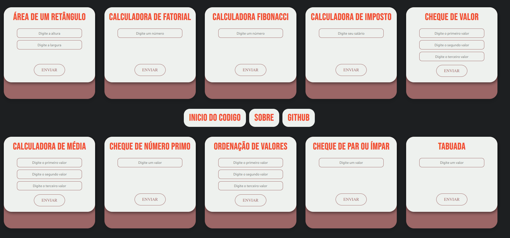
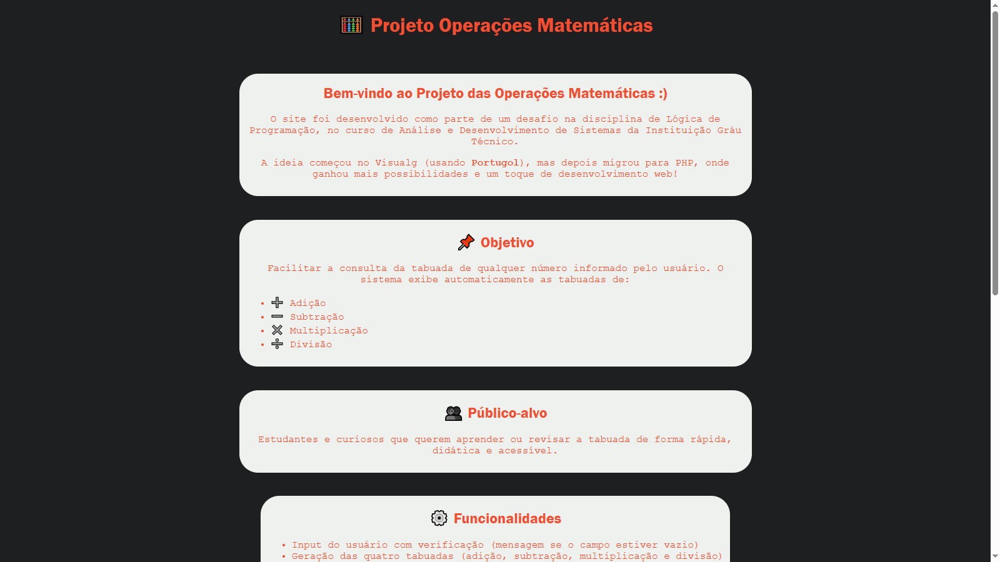

# Projeto MathOps

## </> Tecnologias

 
 

<h3>Tela Inicial do MathOps</h3>  

 
<h3>Sobre do MathOps</h3>  

## ⚙️ Funcionalidades

 Vamos resolver seus problemas em relação a terrível e infame matemática com as seguintes funcionalidades:
 
 - Aritmética Básica
 - Equações
 - Matemática Financeira
 - Geometria
 
Nós vamos te elevar a outro nível nos seus estudos. 

***Boa sorte!***

## 💻 Pré-requisitos

Antes de começar, verifique se você atendeu aos seguintes requisitos:

- Você instalou a versão mais recente do seu navegador
- Você tem uma máquina (PC ou Notebook) com um dos sistemas operacionais citados abaixo:  

    
- Você pode acessar opcionalmente por um dispositivo mobile:   
     
     

## 🌐 Suporte aos navegadores

|  Microsoft Edge |  Firefox |  Chrome |  Safari |  iOS Safari |  Samsung |  Opera |
| --------- | --------- | --------- | --------- | --------- | --------- | --------- |
| IE11, Edge| last 2 versions| last 2 versions| last 2 versions| last 2 versions| last 2 versions| last 2 versions

    

## 🚀 Acessando o nosso site :) 

Acessar o MathOps é extremamente facil :)

[Link do Projeto MathOps](https://louis0113.github.io/projeto-frontend-grau/)

<h3>Tá no celular e tá com preguiça?</h3> 
<h4>Relaxa temos um QR Code para você entrar no site apenas aponte sua camêra no <strong>QR Code</strong> abaixo:</h4>

## 📫 Contribuindo para o MathOps

Para contribuir com **MathOps** , siga estas etapas:

1. Clone o repositório: `git clone <link-do-repo-remoto>`
2. Crie uma branch: `git checkout -b <nome_branch>`.
3. Faça suas alterações e confirme-as: `git commit -m '<mensagem_commit>'`
4. Envie para o branch original: `git push origin <nome_do_projeto> / <local>`
5. Crie a solicitação de pull.

Como alternativa, consulte a documentação do GitHub em [como criar uma solicitação pull](https://help.github.com/en/github/collaborating-with-issues-and-pull-requests/creating-a-pull-request).

## 🤝 Colaboradores

Agradecemos às seguintes pessoas que contribuíram para este projeto:

<table>
  <tr>
    <td align="center">
      <a href="https://github.com/louis0113" title="Link Github Luiz Henrique Ramos ">
         
        
          <b>Luiz Henrique Ramos</b>
        
      </a>
    </td>
    <td align="center">
      <a href="https://github.com/luiz-f5" title="Link Github Luiz Henrique Ferreira">
         
        
          <b>Luiz Henrique Ferreira</b>
        
      </a>
    </td>
    <td align="center">
      <a href="https://github.com/Mattheushmc" title="Link Github Mateus Henrique">
         
        
          <b>Mateus Henrique</b>
        
      </a>
    </td>
  </tr>
</table>

### 👨🏻‍💻 Stats dos Colaboradores

## 😄 Seja um dos contribuidores

Quer fazer parte desse projeto? Clique [AQUI](CONTRIBUTING.md) e leia como contribuir.

## 📝 Licença

Esse projeto está sob licença. Veja o arquivo [LICENÇA](LICENSE.md) para mais detalhes.
